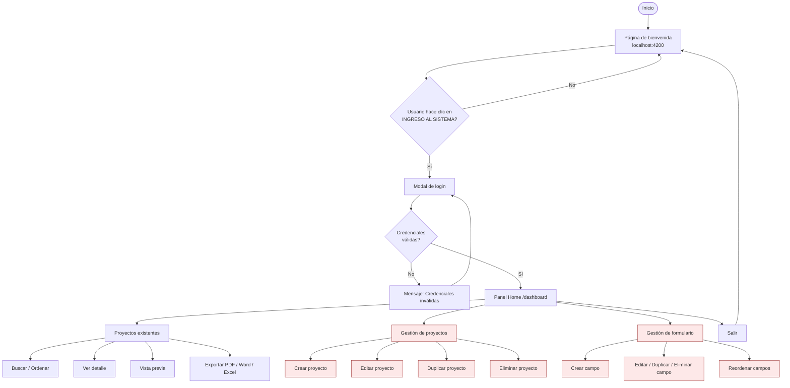
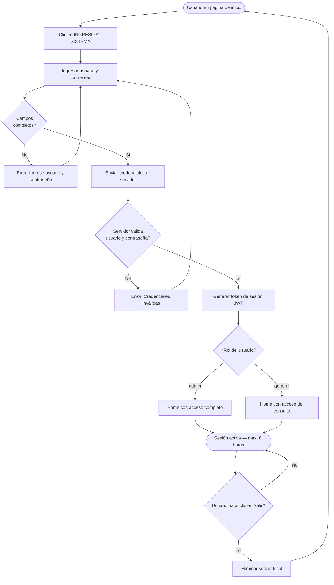
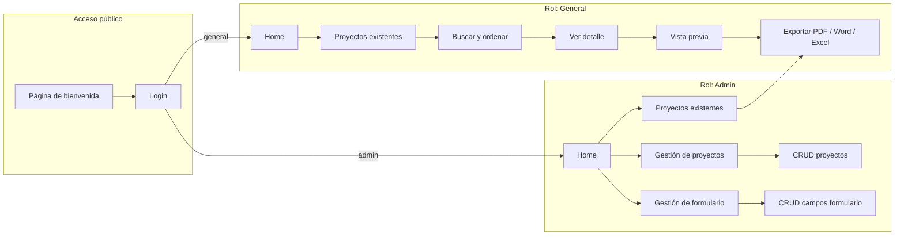
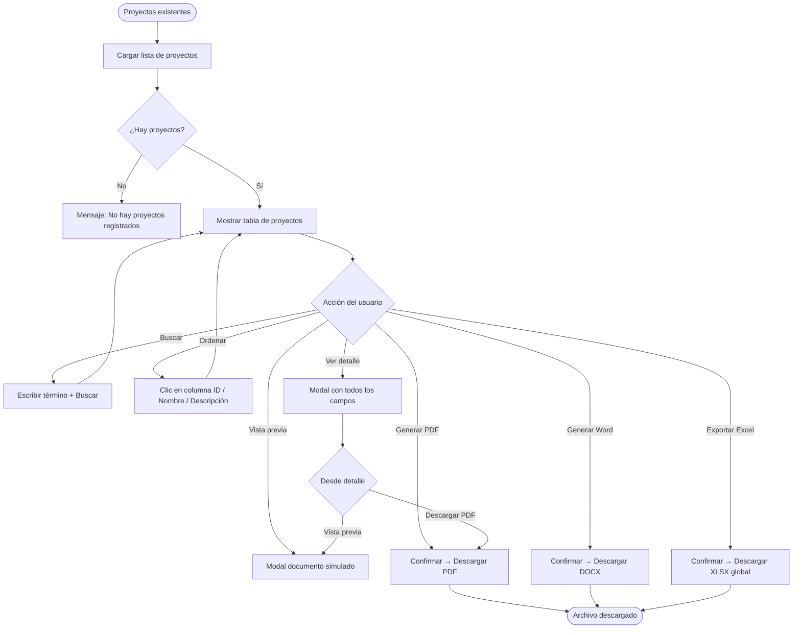
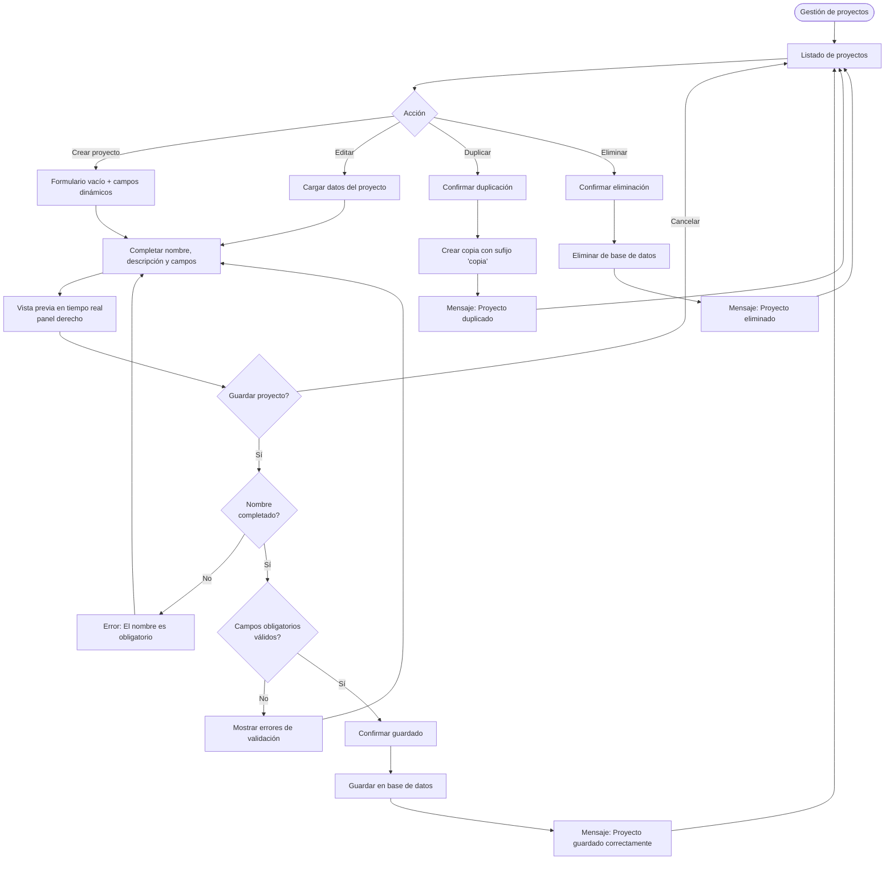
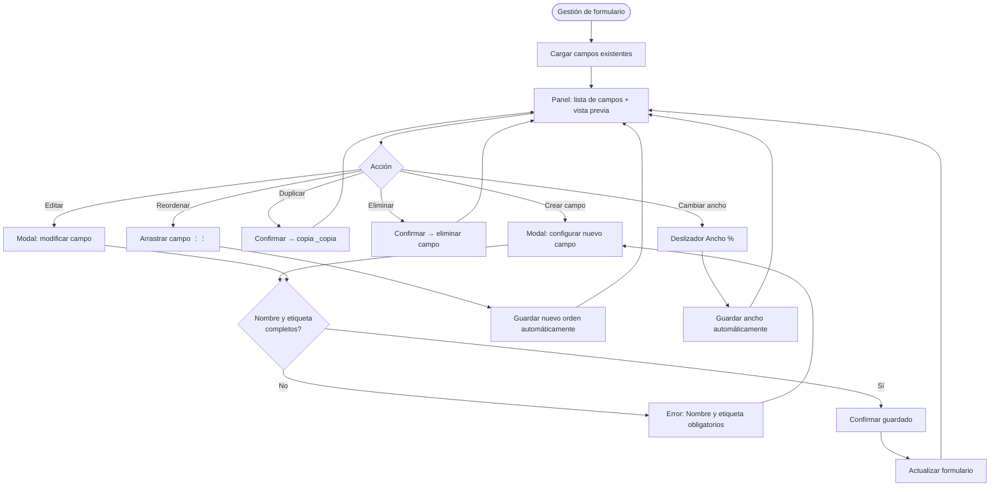
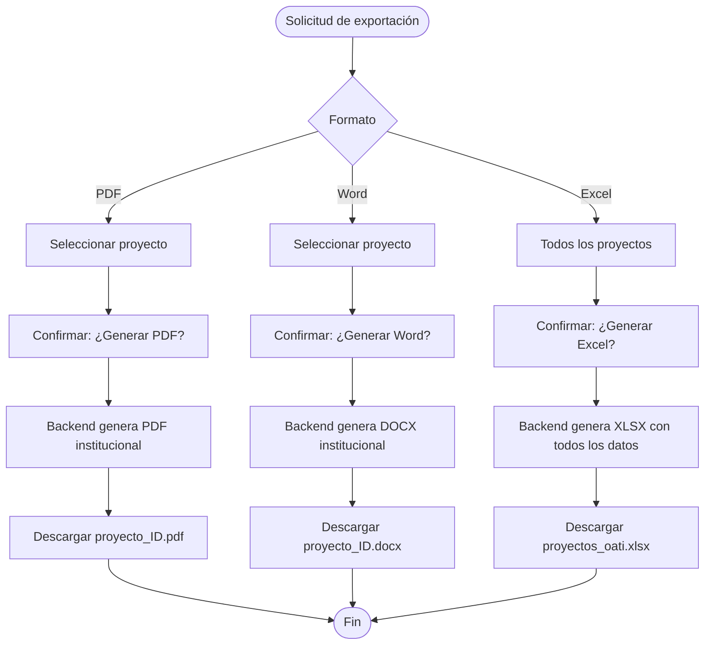
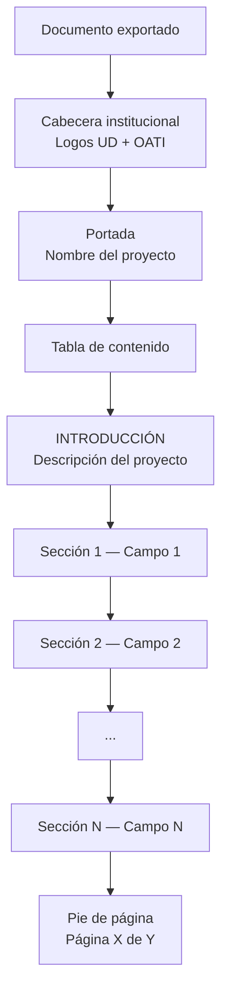
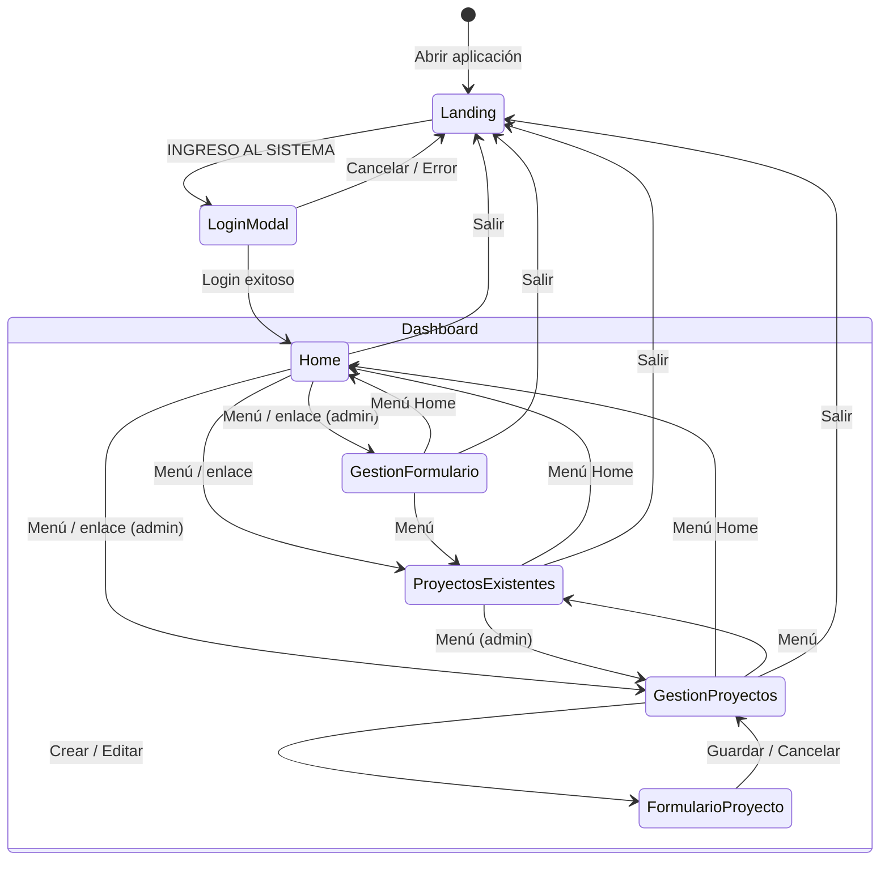
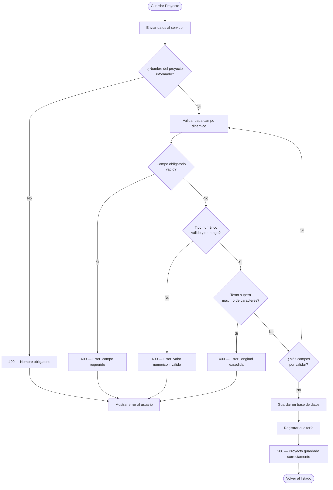

# Diagramas de Flujo
## Sistema de Gestión de Proyectos OATI

Este documento describe los flujos principales del sistema mediante diagramas. Puede visualizarlos en GitHub, VS Code (extensión Mermaid) o en [mermaid.live](https://mermaid.live).

---

## 1. Flujo general del sistema

Visión de alto nivel desde el acceso hasta las operaciones principales.

> Los nodos en rojo claro corresponden a funciones **exclusivas del rol Admin**.

---

## 2. Flujo de autenticación

---

## 3. Flujo por rol de usuario

---

## 4. Flujo de consulta y exportación (Admin y General)

---

## 5. Flujo de gestión de proyectos (solo Admin)

---

## 6. Flujo de gestión de formulario (solo Admin)

---

## 7. Flujo de exportación de documentos

### Estructura del documento PDF/Word

---

## 8. Flujo de navegación entre pantallas

---

## 9. Flujo de validación al guardar un proyecto

---

## Leyenda

| Símbolo / Color | Significado |
|-----------------|-------------|
| `([  ])` | Inicio o fin de proceso |
| `{  }` | Decisión / condición |
| `[  ]` | Acción o pantalla |
| Nodos rojo claro | Solo rol **Admin** |
| Flecha → | Flujo secuencial |

---

*Diagramas del Sistema de Gestión de Proyectos OATI — Universidad Distrital Francisco José de Caldas.*
